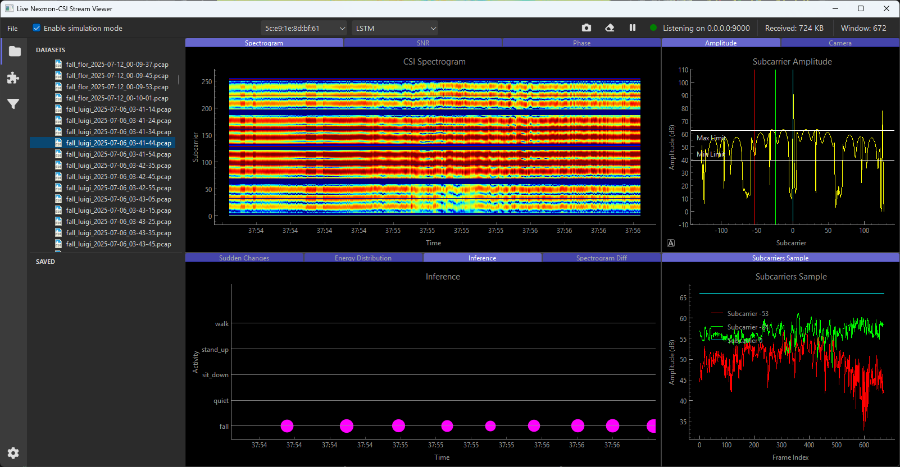

# CSI Suite

CSI Suite is a comprehensive desktop toolkit for Wi-Fi Channel State Information (CSI) analysis and Human Activity Recognition (HAR). The application provides real-time CSI data capture, visualization, filtering, and machine learning inference capabilities.

## Overview

The software was developed iteratively as a supporting tool for CSI research stages. The interface design is inspired by Visual Studio Code to provide an intuitive experience for developers and researchers. It features a top toolbar with multiple actions, a left sidebar with access to specific modules, and a central panel-based workspace that users can resize, arrange, and group according to their preferences.

## Key Features

### 1. CSI Data Collection, Storage and Playback

- **Real-time UDP listening**: Captures CSI packets in Nexmon format on configurable interface and port (default: all interfaces, port 9000)
- **High-speed processing**: Uses optimized libraries for packet processing and memory storage
- **Memory management**: Maintains up to 2048 frames in memory with automatic buffer management
- **Live control**: Pause/Resume data collection with visual status indicators (green=active, red=paused)
- **Data persistence**: Save captured CSI to PCAP files and reload for later analysis
- **Simulation mode**: Replay PCAP files in real-time using original timestamps
- **Multi-device support**: Filter and select CSI data by MAC address when multiple devices are present

### 2. Real-time CSI Visualization

The application provides multiple synchronized visualization panels that update in real-time:

- **Spectrogram**: Time-frequency representation showing subcarrier amplitude over time in dB
- **Amplitude Plot**: Current frame amplitude per subcarrier with adjustable min/max limits for spectrogram scaling
- **Subcarrier Evolution**: Track up to 3 selected subcarriers over time with color-coded traces
- **Differential Analysis**: First and second-order amplitude differences for variation detection
- **Energy Distribution**: Normalized energy distribution across subcarriers over time
- **Phase Visualization**: Unwrapped phase values per subcarrier in radians
- **SNR Analysis**: Signal-to-Noise Ratio per subcarrier with noise detection highlighting

All plots feature synchronized zooming and offer export capabilities (CSV, HDF5, PNG, TIF, JPG, SVG) via right-click context menus.

### 3. Synchronized Sample Recording

Supports labeled dataset creation with:

- **Batch recording**: Configure multiple captures with customizable loops, delays, and duration
- **Audio cues**: Start/end signals with beeps for precise timing
- **Automatic naming**: Files saved as `<label>_<timestamp>.pcap` format
- **Video integration**: Optional synchronized camera recording (MP4 format) for visual validation
- **Session management**: Visual indicators for recording status and inter-capture delays

### 4. Sample Explorer

- **Dataset organization**: Browse collected datasets and recent samples
- **Quick playback**: Double-click samples to load and analyze
- **Video synchronization**: Automatic playback of associated video files when available
- **File management**: Integration with operating system file explorer

### 5. Live Signal Filtering

Real-time CSI filtering capabilities:

- **Multiple filters**: Supports Kalman adaptive filtering and custom noise filters
- **Performance monitoring**: CPU usage and relative performance metrics for last 100 filtering rounds
- **Dual storage**: Maintains both original and filtered CSI data
- **Modular architecture**: Common interface for easy filter development and integration

### 6. Module Management

- **Performance monitoring**: Track CPU consumption and relative performance of all modules
- **Selective activation**: Enable/disable modules to optimize performance during high-throughput collection
- **Resource optimization**: Fine-tune system performance based on specific analysis needs

### 7. Live HAR Inference

Real-time machine learning inference:

- **Model selection**: Choose from pre-trained HAR models
- **Configurable intervals**: Adjust prediction frequency and consensus windows
- **Confidence thresholds**: Set minimum confidence levels for predictions
- **Activity visualization**: Real-time activity recognition results with CSI correlation
- **Interactive analysis**: Mouse-over predictions highlight corresponding CSI data in spectrogram

## Technical Specifications

- **Data Format**: Nexmon CSI packet format
- **Network Protocol**: UDP (default port 9000)
- **File Formats**: PCAP for CSI data, MP4 for video recordings
- **Export Formats**: CSV, HDF5, PNG, TIF, JPG, SVG
- **Memory Management**: Circular buffer with 2048 frame limit
- **Real-time Performance**: Optimized processing pipeline with performance monitoring

## Use Cases

- **Research**: CSI data collection and analysis for academic studies
- **HAR Development**: Dataset creation and model validation for human activity recognition
- **Signal Analysis**: Real-time CSI visualization and filtering for signal processing research
- **Model Testing**: Live inference validation and performance assessment

## Architecture

The application follows a modular design with:
- Plugin-based visualization system
- Common interfaces for filters and modules
- Performance monitoring and resource management
- Extensible architecture for custom modules and filters

CSI Suite serves as a comprehensive platform for CSI research, providing tools for data collection, analysis, visualization, and machine learning inference in a unified, user-friendly interface.

## License

This project is licensed under the MIT License - see the [LICENSE](LICENSE) file for details.
